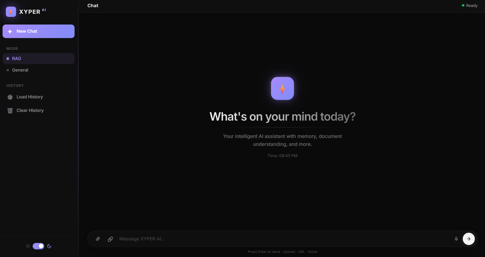

# RAG AI Chatbot

A production-style Retrieval-Augmented Generation (RAG) chatbot with a polished web interface. Upload documents (PDF, DOCX, TXT, MD), fetch content from URLs, or add images to the knowledge base — then ask questions and get **streamed, source-grounded answers** from a large language model.

Built as a practical showcase of the full RAG pipeline: **document ingestion → chunking → vector embeddings → similarity search → LLM generation**, wrapped in a clean, glassmorphism web UI.





## Highlights

- **Dual chat modes** — RAG (answers grounded in your documents) and General (open conversation)
- **Streaming responses** — token-by-token delivery over Server-Sent Events with a live "thinking" indicator
- **Conversation memory** — per-session history stored in Redis (Upstash)
- **Voice input** — offline speech-to-text via faster-whisper
- **Multi-format ingestion** — PDF, DOCX, TXT, MD, plus text and image uploads
- **URL fetching** — paste a link and chat about its content
- **Glassmorphism UI** — dark/light themes, responsive layout, animated thinking dots

## Live Demo

**Try it live:** [https://rag-ai-chatbot-0pyl.onrender.com](https://rag-ai-chatbot-0pyl.onrender.com)

## Technology Stack

| Layer | Technology | Role |
|-------|-----------|------|
| **LLM** | Groq `llama-3.3-70b-versatile` | Fast inference, grounded answers |
| **Embeddings** | Cohere `embed-v4.0` (1536-d) | Text + image vectorization |
| **Vector DB** | Pinecone (serverless) | Dense similarity search |
| **Memory** | Upstash Redis | Session history + context |
| **Speech-to-Text** | faster-whisper (local, offline) | Voice queries |
| **Backend** | Flask | REST + SSE API |
| **Frontend** | Vanilla HTML/CSS/JS | Responsive glassmorphism UI |
| **Parsing** | PyPDF2, python-docx, BeautifulSoup, trafilatura | Document + URL extraction |

## Why This Stack (Design Decisions)

Every layer was chosen deliberately — this is exactly what you'd discuss in a system-design or RAG interview:

| Decision | Why |
|----------|-----|
| **Groq instead of OpenAI/Anthropic** | ~10x faster token generation on `llama-3.3-70b`, generous free tier (14,400 req/day). Critical for a *streaming* chat experience. |
| **Cohere embed-v4.0 instead of OpenAI embeddings** | Single model handles **both text and images** (1536-dim, cross-modal). No need for a separate image encoder. |
| **Pinecone serverless** | Zero infrastructure to manage. Auto-scaling, no idle timeouts on free tier (500K vectors). |
| **Upstash Redis** | Serverless-compatible Redis. No persistent connection to babysit — works perfectly on free-tier hosting like Render. |
| **faster-whisper (local STT)** | CTranslate2-optimized Whisper — runs on CPU in <1s per query. No cloud STT cost, no latency, no data leaves the machine. |
| **Vanilla JS frontend** | Zero build step. One HTML file serves the whole UI — trivial to deploy anywhere. |
| **SSE instead of WebSockets** | One-way streaming is exactly what chat needs. SSE rides on plain HTTP — simpler than WebSocket lifecycle, works through proxies/CDNs. |

## Architecture

```
User Input
   │  (text / file / URL / voice / image)
   ▼
Flask API  ──►  /api/chat/stream (SSE)
   │
   ├─►  RAG Mode:
   │      query ──► Cohere embed ──► Pinecone top-k search ──► context ──┐
   │                                                                     ├──► Groq LLM ──► streamed answer
   └─►  General Mode:                                                     │
          query ─────────────────────────────────────────────────────►────┘

Redis (Upstash)  ──►  session history injected as context
faster-whisper    ──►  /api/transcribe for voice queries
BeautifulSoup / trafilatura ──►  /api/fetch-url for web content
```

### How the RAG pipeline works (step by step)

1. **Ingestion** — a document arrives (file / paste / URL / image).
2. **Parsing** — `document_parser.py` extracts raw text per format (PyPDF2 for PDF, python-docx for DOCX, plain reader for TXT/MD).
3. **Chunking** — text is split into overlapping chunks (default 1000 chars, 200 overlap) to keep semantic units intact and give the retriever many small, focused pieces to match against.
4. **Embedding** — each chunk is vectorized with Cohere `embed-v4.0` into a 1536-dimension vector.
5. **Indexing** — vectors are upserted into a Pinecone serverless index (`rag-documents`, cosine distance).
6. **Query time** — the user's question is embedded, then `search()` runs a cosine similarity top-k query (default k=5) against the index.
7. **Relevance filter** — results below a similarity threshold (default 0.30) are discarded, so the LLM never sees irrelevant context.
8. **Context assembly** — top chunks + the last 6 turns of conversation history are formatted into a strict prompt.
9. **Generation** — Groq's `llama-3.3-70b-versatile` answers **only from the retrieved sources**, streamed back token-by-token over SSE.
10. **Memory** — the exchange is saved to Upstash Redis for the session, so follow-up questions ("what about its second point?") work naturally.

### Fallback behaviour

- URL fetch with BeautifulSoup → falls back to **trafilatura** if extraction yields too little content.
- Image upload → embedded via Cohere's visual embedding; the Groq vision description is attempted and skipped gracefully on failure.

## Quick Start

### Prerequisites

- Python 3.10+
- Free API keys (Groq, Cohere, Pinecone, Upstash Redis)

### 1. Clone & install

```bash
git clone https://github.com/Sharda2004196/rag-ai-chatbot.git
cd rag-ai-chatbot
pip install -r requirements.txt
```

### 2. Configure API keys

```bash
cp .env.example .env
```

Then fill in the keys:

```env
GROQ_API_KEY=your_groq_key
COHERE_API_KEY=your_cohere_key
PINECONE_API_KEY=your_pinecone_key
UPSTASH_REDIS_URL=your_redis_url
UPSTASH_REDIS_TOKEN=your_redis_token
```

All services offer generous free tiers — no credit card required.

### 3. Run

```bash
python app.py
```

Open **http://localhost:5000** in your browser.

## Usage

### Chat modes

- **RAG mode** — the app retrieves the most relevant document chunks (top-k with a relevance threshold) and the LLM answers strictly from that context.
- **General mode** — direct LLM conversation, no document grounding.

### Feeding the knowledge base

- **Upload files** — PDF, DOCX, TXT, MD (up to 16 MB)
- **Paste text** — ingest raw text directly
- **Fetch a URL** — extracts readable article content (BeautifulSoup, with trafilatura fallback)
- **Upload an image** — embedded with a vision embedding model and added to the knowledge base

### Voice queries

Click the mic button, speak, and the transcription is inserted into the input box automatically (faster-whisper runs locally).

## Example Interaction

```
User:  "What are the key features of Python according to the document?"
Bot:   "Based on the uploaded document, Python's key features include:
       - Easy to learn and read
       - Extensive standard library
       - Dynamic typing and garbage collection
       - Cross-platform compatibility"        [RAG mode · 2 sources]

User:  "Can you elaborate on the standard library part?"
Bot:   "The standard library provides modules for file I/O, networking,
       math, and web development out of the box, which means..."        [context from memory]
```

## API Reference

### `POST /api/chat` — non-streaming chat

```json
{ "query": "What is this document about?", "mode": "rag", "session_id": "abc123" }
```

```json
{
  "answer": "This document covers...",
  "sources": [{ "text": "...", "score": 0.87, "metadata": {} }],
  "mode": "rag"
}
```

### `POST /api/chat/stream` — streaming chat (SSE)

Returns `data: {"type":"text","content":"..."}` events, terminated by `data: {"type":"done",...}`.

```
data: {"type":"text","content":"Based"}
data: {"type":"text","content":" on the document"}
data: {"type":"done","answer":"Based on the document...","mode":"rag"}
```

### `POST /api/transcribe` — voice-to-text

Multipart `file` upload (webm/mp3/wav) → `{ "text": "..." }`.

### `POST /api/fetch-url` — URL content extraction

```json
{ "url": "https://example.com/article" }
```

### `POST /api/upload-image` — image ingestion

Multipart `image` upload (png/jpg/jpeg/gif/webp).

### `POST /api/ingest` — document/text ingestion

File upload via `file` field, or `{ "text": "..." }` for raw text.

### `GET /api/history` · `POST /api/clear-history`

Fetch or clear the conversation history for a session.

### Response shape (all endpoints)

- `200` — success with a JSON body (or SSE stream)
- `400` — bad request (missing file / unsupported type / no query)
- `500` — server error with `{ "error": "<message>" }`

## Project Structure

```
rag-ai-chatbot/
├── app.py                  # Flask server, REST + SSE endpoints
├── rag_chatbot.py          # Core RAG logic, vector ops, LLM + streaming
├── document_parser.py      # PDF/DOCX/TXT parsing
├── requirements.txt        # Python dependencies
├── .env.example            # Environment variable template
├── render.yaml             # Render deployment config
├── templates/
│   └── index.html          # Web interface (single file)
└── README.md
```

## Configuration

| Setting | Location | Default |
|---------|----------|---------|
| Chunk size / overlap | `rag_chatbot.py` `_chunk_text()` | 1000 / 200 chars |
| Retrieval top-k | `rag_chatbot.py` `search()` | 5 |
| Relevance threshold | `rag_chatbot.py` `search()` | 0.30 |
| LLM temperature | `rag_chatbot.py` `_call_groq()` | 0.7 |
| LLM max tokens | `rag_chatbot.py` `_call_groq()` | 2000 |
| Max upload size | `app.py` `MAX_CONTENT_LENGTH` | 16 MB |
| Whisper model | `rag_chatbot.py` `_get_stt_model()` | `base.en` (int8, CPU) |

### Tuning the retriever

- **Smaller documents / precise Q&A** → lower `top_k` (e.g. 3) and raise `min_score` to ~0.4 for precision.
- **Broad summarisation tasks** → raise `top_k` (e.g. 8) and lower `min_score` to ~0.2 for recall.
- **Conversation quality** → raise temperature to 0.8; for factual answers keep 0.2–0.5.

## Rate Limits & Free Tiers

| Service | Free Tier Limit | What happens at the limit |
|---------|----------------|---------------------------|
| **Groq** | ~14,400 req/day, ~30 req/min | API returns `429`; retry after the reset window |
| **Cohere** | 100 API calls/min (trial) | API returns `429`; raise rate or upgrade |
| **Pinecone** | 500K vectors, serverless on-demand | No hard daily cap; billing scales with usage |
| **Upstash Redis** | ~10K commands/day free | Database paused/archived after prolonged inactivity |

> The app makes **1–3** Groq calls per chat turn (0 for general mode when no docs), so the daily quota comfortably covers hundreds of conversations. Embedding calls are batched per ingestion.

## Deployment

### Render (recommended)

This repo includes `render.yaml`. Deploy directly:

1. Push this repository to GitHub.
2. In Render, create a **New Web Service** and connect the repo.
3. Render auto-detects `render.yaml` (build + start commands, env var sync).
4. Add the required environment variables in the Render dashboard.

> Free-tier services may spin down after inactivity (cold start of ~50s on first request).

### Any cloud / VPS

```bash
pip install -r requirements.txt
python app.py
```

Set the five environment variables and expose port 5000.

## Troubleshooting

 Here's the honest engineering log from this project:

### 1. "charmap codec can't encode character" crash
- **Cause**: Unicode characters (✓, ❌, emoji) printed to a Windows console with `cp1252` encoding.
- **Fix**: Replaced non-ASCII status symbols with ASCII-safe `[OK]`, `[ERROR]`, `[Sources]` throughout the logging paths.

### 2. Groq 400 Bad Request
- **Cause**: The original `llama-3.1-70b-versatile` model was decommissioned upstream.
- **Fix**: Migrated to `llama-3.3-70b-versatile` (verified live at `rag_chatbot.py`).

### 3. Pinecone "index not found" on first run
- **Cause**: No index existed yet.
- **Fix**: The app now creates the `rag-documents` index automatically on startup if missing (`rag_chatbot.py` `_init_index()`), then verifies readiness before use.

### 4. "Unauthorized" / 401 errors from any provider
- **Fix**: Check `.env` keys have no extra spaces/quotes; confirm keys are active in the provider dashboard; verify the app loaded them (debug log prints key length).

### 5. Slow responses
- **Cause**: Free-tier cold start, large documents, or 30s Groq timeout under load.
- **Fix**: Keep chunks ~1000 chars; use `load_dom`-style fast paths; upgrade service or accept cold-start on free tier.

### 6. PDF parses to empty text
- **Cause**: Scanned/image-only PDFs contain no extractable text layer; password-protected PDFs fail.
- **Fix**: Use OCR for scanned PDFs; unlock password-protected files before upload. PyPDF2 only reads text layers.

### 7. Voice input gives no transcription
- **Cause**: First run downloads the Whisper `base.en` model (~75MB); missing model = silent failure.
- **Fix**: Allow the one-time model download; ensure a stable connection. Transcriptions run locally afterwards.

### 8. RAG answers "I don't have enough information"
- **Cause**: No documents ingested for the session, or retrieved chunks scored below the 0.30 relevance threshold.
- **Fix**: Upload relevant documents, or switch to General mode for open conversation.

### 9. URL fetch returns short/empty content
- **Cause**: JavaScript-rendered sites, paywalls, or anti-bot blocks.
- **Fix**: The code auto-falls back to `trafilatura`; for JS-heavy sites the extracted content may still be limited.

## Roadmap

- [x] Conversation memory (Redis)
- [x] Streaming responses
- [x] Voice input (faster-whisper)
- [x] URL content ingestion
- [x] Image ingestion
- [ ] Reranking of retrieved chunks
- [ ] Hybrid search (BM25 + dense)
- [ ] Grounding / hallucination evaluation harness
- [ ] Document management (list, delete)

## Contributing

Contributions are welcome! Open an issue or submit a pull request.

1. Fork the repository
2. Create a feature branch (`git checkout -b feature/your-feature`)
3. Commit your changes
4. Push and open a Pull Request

## License

This project is licensed under the MIT License.

---

Built with Python, Flask, and the Groq · Cohere · Pinecone ecosystems.
